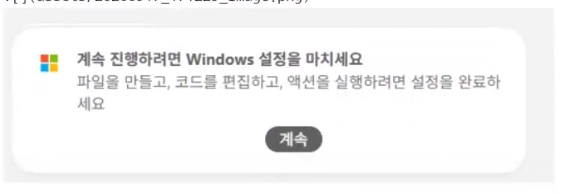
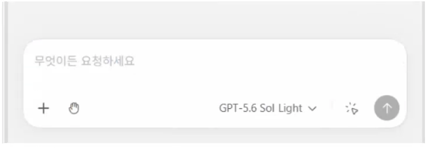
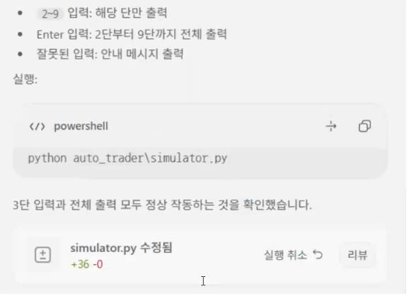

ai-vibecoding-2026

바이브코딩 리포지토리

#### Chapter 1

AI에게 코딩을 시키자. 제대로!

### 개념

코딩을 직접하지는 말 것. AI와 협업해서 새로운 프로그램을 만들자

### 기존 개발 방법

요구사항 분석 -> 설계 (DB/UI 포함) -> 구현/디버깅 -> 테스트 -> 배포 -> 유지보수

### 바이브코딩 방식

요구사항정의 (PRD) -> AI 코드 생성/ 디버깅,테스트 -> 사람 검증 수정 요청, 직접 수정-> 배포
-> AI 유지보수

### 핵심 포인트

- AI - 주니어 /시니어 개발자
- 사람- PM + 리뷰어

### 바이브코딩 개발환경

- VS Code, VS Code Insdier, Andorid Studio...

### VS Code

- 채팅 창- 안씀
- 확장 패키지- codex, claude Code for VS Code, Gemini Code Asisist

#### Codex

- 설치 후 확장 아이콘 아래, Codex 아이콘 생성 됨
- 로그 인 웹 브라우저 연결
- 설정화면 설정 필요

- 추가파일 codex-*-sandbox.exe 파일설치

- 최종화면
- 채팅 창 명령 / 여러LLM에 전달할 명령어 리스트

#### 바이브코딩 맛보기

- 결과 메세지 화면
- 소스

### CLI Codex

- 파워쉘 콘솔 창에서 명령어로 수행하는 Codex

### 바이브 코딩

- 제로샷 프롬프트 : 아무런 기초지식없이 대화로 바이브코딩
- 원샷 프롬프트 : 적어도 한 줄의 요구사항을 작성해서 바이브코딩
- 큐샷 프롬프트 : PRD를 작성해서 바이브코딩

### 자동매매 개발환경

#### 토스증권 OpenAPI

https://www.tossinvest.com/ko/open-api
- 토스앱 모바일 설치 가입
- 토스증권 사용 설정
- 토스증권 PC 웹사이트 동작
- 사용중인 아이피를 토스증권 PC등록
- OPEN API 키 발급 후 Client ID, Client Secret 문자열 보관
-https://developers.tossinvest.com/docs 

### API 신청

- PC에서 투자하기 클릭
- 토스앱 모바일로 로그인 인증
- 오른쪽 하단 기어모양 아이콘 (설정)
- Client ID, Client Secret, IP 추가()
- card> ipconfig로 보안 아이피 확인 후 추가

### 주식 자동매매 파이썬 프로그램 분석

 - '__init__py' - 일반적으로 파일만 생성 소스코드 x프로젝트 폴더가 pip로 설치할 수 있는 패키지화
 -'__main__py'  - 파이썬으로 실행될 때 가장먼저 실행되는 메인 함수 파일
 - '__pycache__' - 미리 만들어놓은 파이썬 실행 파일 (케시)
 - 'test'  소스코드 테스트를 위한 
 - env,example -환경 설정 예제파일 .example을 지우고 사용
 - __.env는 